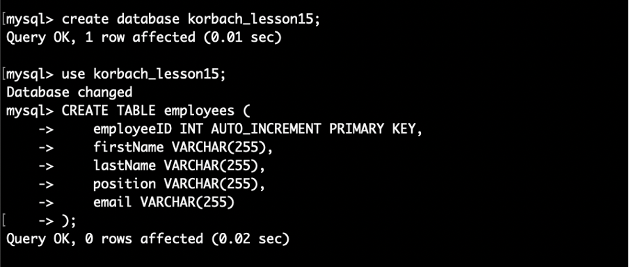
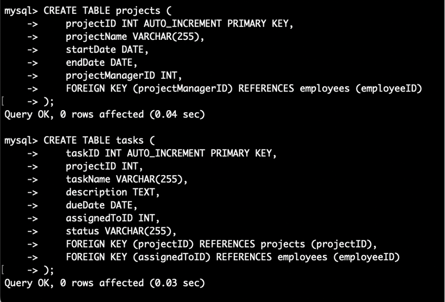
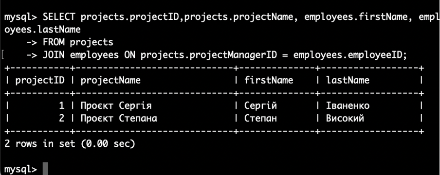
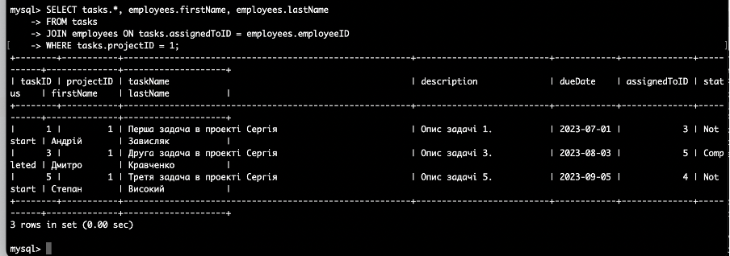
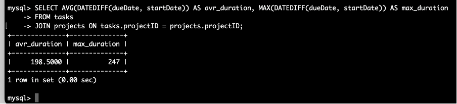

Створіть базу даних з необхідними таблицями, використовуючи SQL.

Використовується mysql 8.1

Додайте принаймні два проєкти, три завдання для кожного проєкту та п'ять працівників.
INSERT INTO employees (firstName, lastName, position, email)
VALUES
('Сергій', 'Іваненко', 'Middle Developer', 'sergiy.ivanynko@gmail.com'),
('Олександр', 'Степаненко', 'QA Engineer', 'alex.st@gmail.com'),
('Андрій', 'Зависляк', 'Junior Developer', 'andrey@gmail.com'),
('Степан', 'Високий', 'Senior Developer', 's.visokii@gmail.com'),
('Дмитро', 'Кравченко', 'QA Engineer', 'd.kr@gmail.com');

INSERT INTO projects (projectName, startDate, endDate, projectManagerID)
VALUES
('Проєкт Сергія', '2023-01-01', '2024-01-01', 1),
('Проєкт Степана', '2023-02-02', '2024-02-02', 4);
INSERT INTO tasks (projectID, taskName, description, dueDate, assignedToID, status)
VALUES
(1, 'Перша задача в проекті Сергія', 'Опис задачі 1.', '2023-07-01', 3, 'Not start'),
(2, 'Перша задача в проекті Степана', 'Опис задачі 2.', '2023-07-02', 4, 'In Progress'),
(1, 'Друга задача в проекті Сергія', 'Опис задачі 3.', '2023-08-03', 5, 'Completed'),
(2, 'Друга задача в проекті Степана', 'Опис задачі 4.', '2023-08-04', 3, 'In Progress'),
(1, 'Третя задача в проекті Сергія', 'Опис задачі 5.', '2023-09-05', 4, 'Not start'),
(2, 'Третя задача в проекті Степана', 'Опис задачі 6.', '2023-09-06', 5, 'Completed');
Напишіть SQL-запит, який виведе всі проєкти разом зі списком працівників, які ними керують.
SELECT projects.projectID,projects.projectName, employees.firstName, employees.lastName
FROM projects
JOIN employees ON projects.projectManagerID = employees.employeeID;

Напишіть SQL-запит, який виведе всі завдання для конкретного проєкту разом з працівниками, яким призначено ці завдання.

SELECT tasks.*, employees.firstName, employees.lastName
FROM tasks
JOIN employees ON tasks.assignedToID = employees.employeeID
WHERE tasks.projectID = 1;

Обчисліть та виведіть середній та максимальний термін виконання завдань усіх проєктів.

SELECT AVG(DATEDIFF(dueDate, startDate)) AS avr_duration, MAX(DATEDIFF(dueDate, startDate)) AS max_duration
FROM tasks
JOIN projects ON tasks.projectID = projects.projectID;

Створіть backup-файл.

